# EVALUACION 01 - PROGRAMACION WEB II

**Estudiantes:**
- Samira Nitza Barrientos Morales
- Carmen Rosario Chavez Hurtado

**Materia:** Programación Web II

## Descripción del Proyecto
Desarrollo de una API REST para la gestión completa (CRUD) de productos.

---

## Tecnologías Utilizadas
* Node.js y Express
* Sequelize (ORM)
* SQL Server
* Postman

## Instrucciones de Ejecución
1. **Instalar dependencias:** Ejecutar `npm install` en la terminal.
2. **Configuración:** Crear un archivo `.env` basado en `.env.example` con las credenciales de SQL Server.
3. **Ejecutar API:** Iniciar el servidor con `node app.js`.

---

## Evidencias del Funcionamiento

### Listar Productos Vacios
**Consulta exitosa (200 OK):**
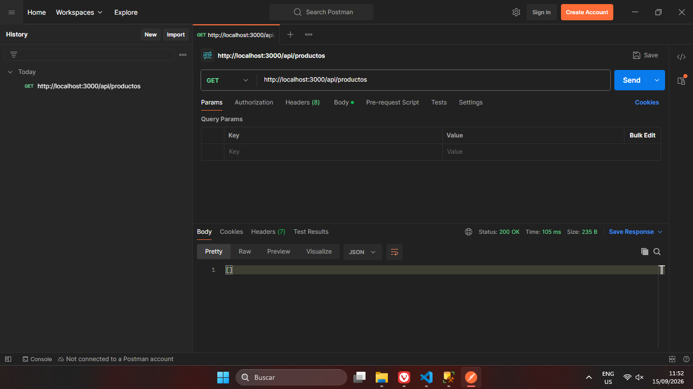

### Registrar Producto (POST)
**Registro exitoso (201 Created):**
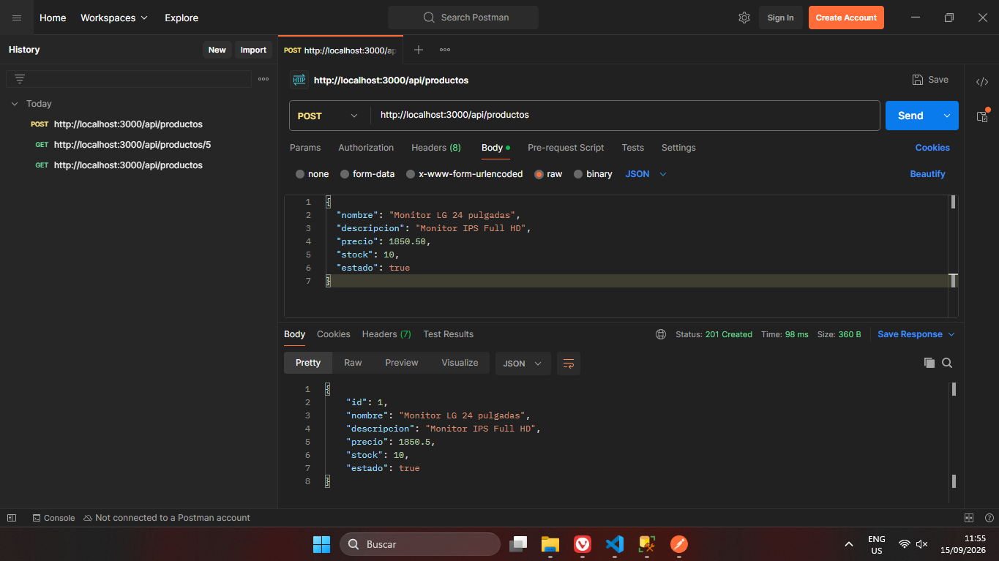

**Prueba de datos inválidos (400 Bad Request):**
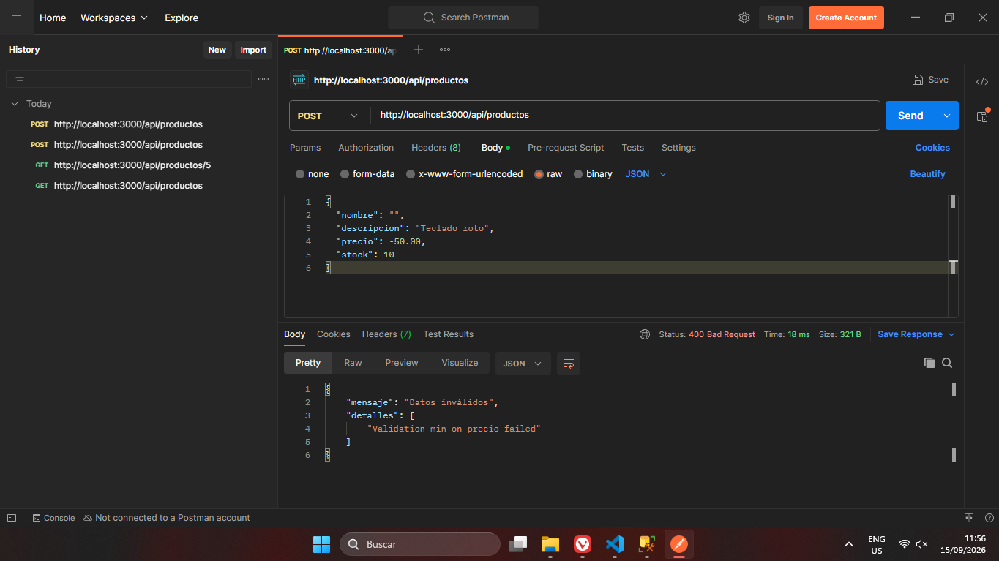

**Vista de la insersion en SQL Server:**
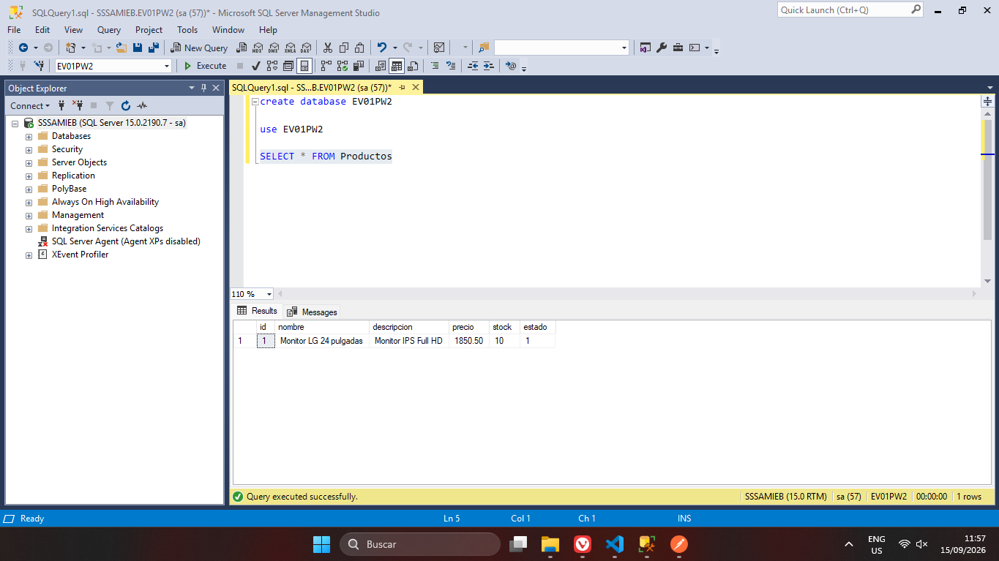

### Listar Productos
**Consulta exitosa (200 OK):**
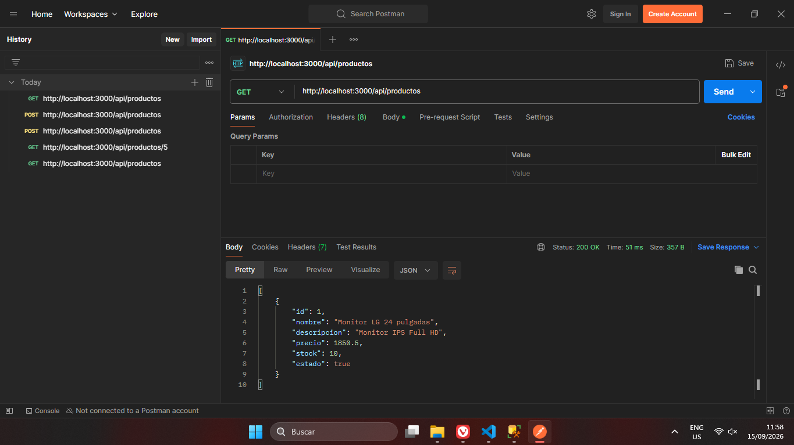

### Obtener Producto por ID (GET :id)
**Consulta exitosa (200 OK):**
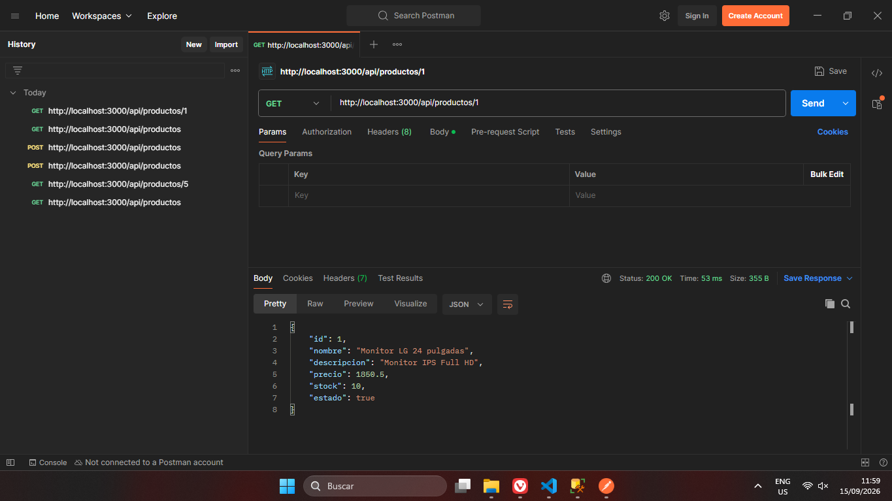

**Producto inexistente (404 Not Found):**
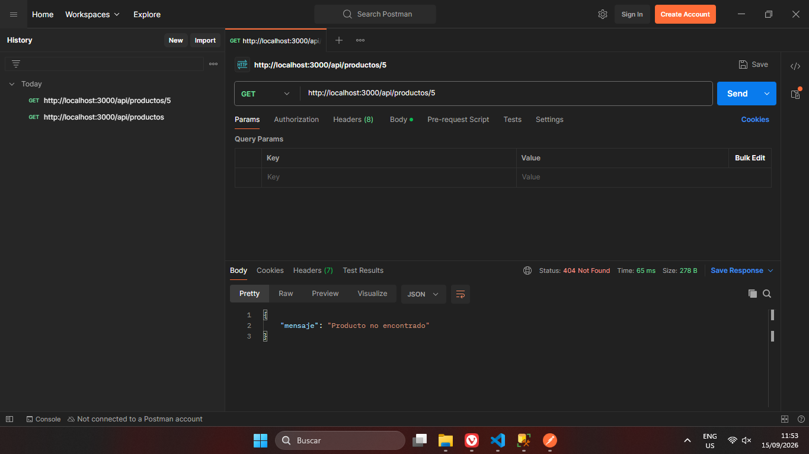

### Búsqueda de Productos (GET buscar)
**Búsqueda con coincidencias parciales (200 OK):**

**Búsqueda sin coincidencias (200 OK):**
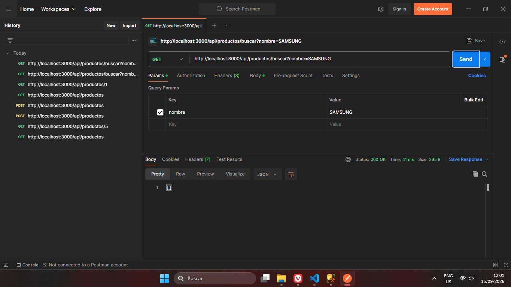

### Actualizar Producto (PUT)
**Actualización exitosa en Postman:**
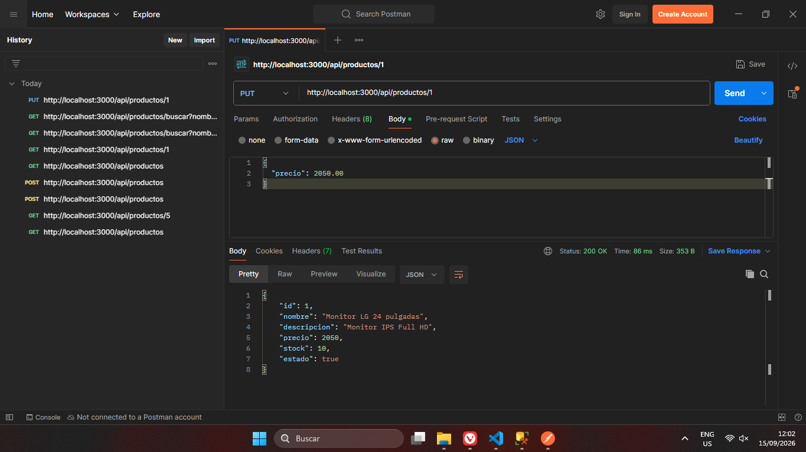

**Vista de actualizacion en SQL Server:**
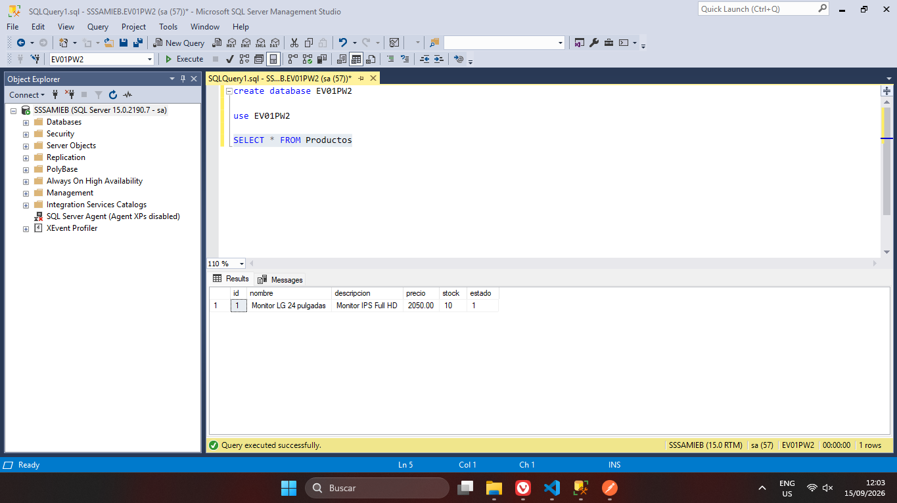

### Eliminar Producto (DELETE)
**Eliminación exitosa en Postman:**
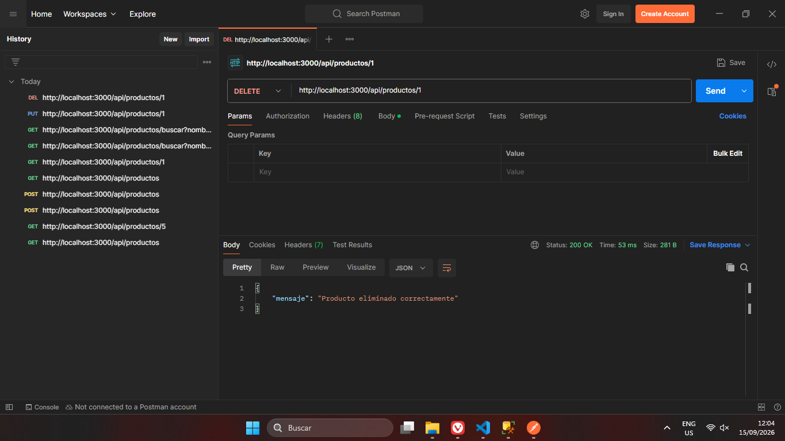

**Vista de borrado en SQL Server:**
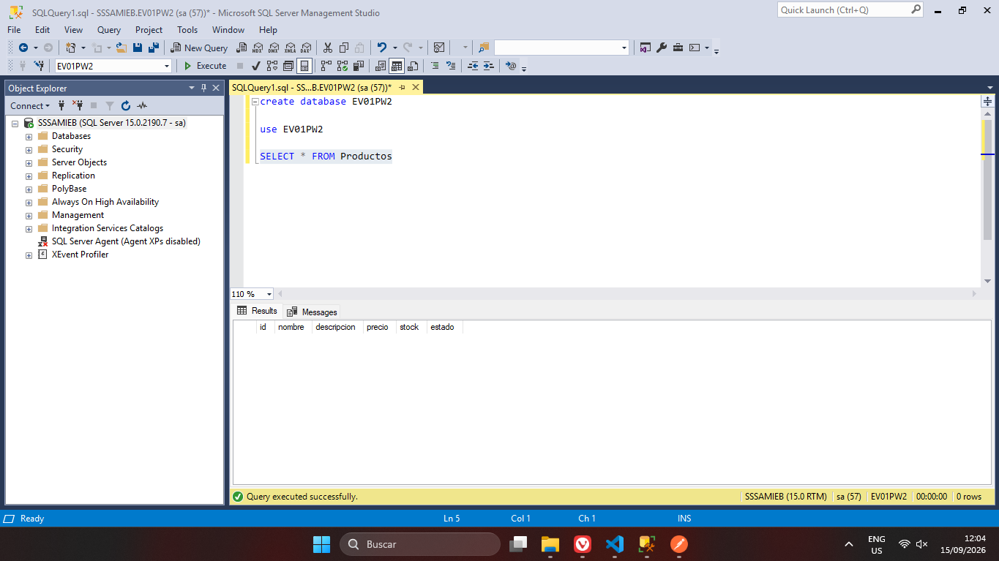